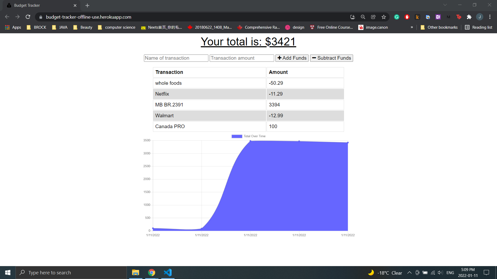

# BankTracker
## Bank Tracker Application
This application can store the deposit transaction and spend/withdraw transaction.  
This application can use for both with or without internet connect. When the internet is offline, the application will use IndexDB, Service workers, 
and Web Manifest for offline and will upload all information to the page when internet back to connection.  
This application is created with using MongoDB, therefore, no database setup needed. 

## About Application
GIVEN a budget tracker without an internet connection 
WHEN the user inputs an expense or deposit 
THEN they will receive a notification that they have added an expense or deposit 
WHEN the user reestablishes an internet connection 
THEN the deposits or expenses added while they were offline are added to their transaction history and their totals are updated 

## Heroku Deployed
This application is deployed to Heroku with using MongoDB Atlas.  
[Heroku Deployed Link](https://budget-tracker-offline-use.herokuapp.com/)
 

